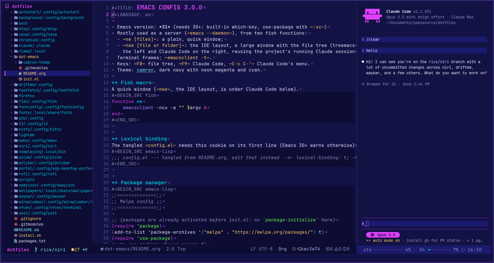

#+TITLE: Camron theme
#+LANGUAGE: en

A dark Emacs theme: a navy background with neon magenta and cyan, ice, lime and yellow
accents.

/The file tree (treemacs), an Org file and Claude Code (claude-code-ide, in eat)./

** Installation

Requires Emacs 29.1+ and [[https://github.com/jasonm23/autothemer][autothemer]] (on MELPA).

#+BEGIN_SRC emacs-lisp
(use-package autothemer :ensure t)
(add-to-list 'custom-theme-load-path "<directory containing camron-theme.el>")
(load-theme 'camron t)
#+END_SRC

It's made for GUI frames and true-colour terminals; 256-colour terminals get the nearest
colours.

** Palette

| Name     | Colour    | Used for                                        |
|----------+-----------+-------------------------------------------------|
| bg       | ~#131244~ | background                                      |
| deep     | ~#0d0c33~ | code blocks, side panels, inactive mode line    |
| panel    | ~#1a1a6e~ | current line, mode line, popups                 |
| edge     | ~#3b2a78~ | selection, borders                              |
| fg       | ~#e8e6ff~ | text, variables                                 |
| dim      | ~#8b8bc7~ | comments                                        |
| faint    | ~#55559a~ | line numbers                                    |
| magenta  | ~#e040fb~ | keywords, cursor, current line number, headings |
| cyan     | ~#00bcd4~ | functions, prompts                              |
| ice      | ~#76e6f2~ | types, properties, links                        |
| violet   | ~#b388ff~ | built-ins                                       |
| yellow   | ~#ffd166~ | strings, warnings                               |
| lime     | ~#69ff47~ | numbers, constants, success                     |
| red      | ~#ff4f79~ | errors                                          |

Terminals inside Emacs (eat, vterm, term, shell, compilation) get a matching 16-colour
palette, so programs running in them use the theme's colours too.

** Covered packages

- Emacs itself: the tree-sitter era syntax faces (numbers, operators, function calls,
  properties…), line numbers, search, diff, dired, which-key, completions, help keys
- Org mode (headings, blocks, TODO states, agenda) and Markdown
- Mode lines: built-in, [[https://github.com/seagle0128/doom-modeline][doom-modeline]], spaceline / powerline
- Completion: vertico, orderless, marginalia, company
- treemacs (and treemacs-nerd-icons)
- flycheck, flymake, lsp-mode / lsp-ui
- rainbow-delimiters, whitespace, js2-mode, typescript-mode

** License

GPL-3.0, see [[./LICENSE][LICENSE]].
